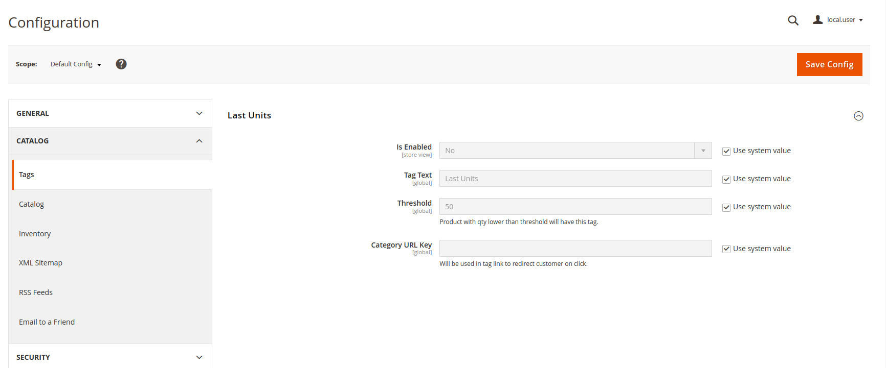
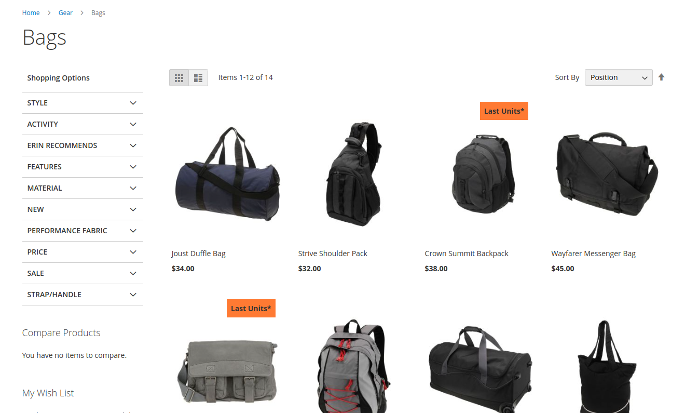
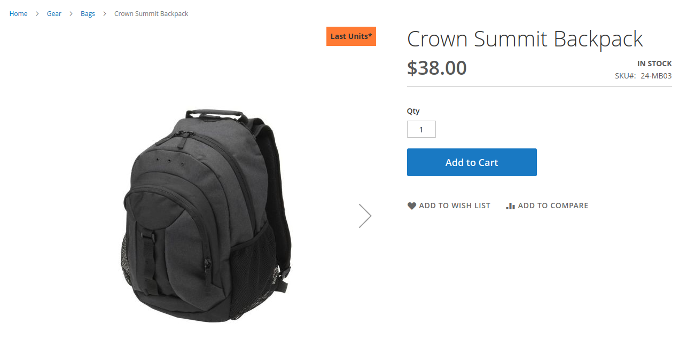

# How To

## Installation

Copy module code into `app/code/Os/LastUnits` folder and run

`bin/magento setup:upgrade`

`bin/magento setup:di:compile`

`bin/magento setup:static-content:deploy`

## Admin Configurations

Log in as a Magento admin user and go to
**Stores->Configuration->Catalog->Tag->Last Units**

Extension is disabled by default.
Configure module to fit your needs, like tag text, qty threshold and category url key, where tag will redirect users on click.

After module was configured, click "Save Config" and clear caches via admin or cli command.

## Front

Tag is visible on PLP and PDP pages.

Tag is clickable and redirects to the category page specified in admin configuration.

Enjoy! :)
